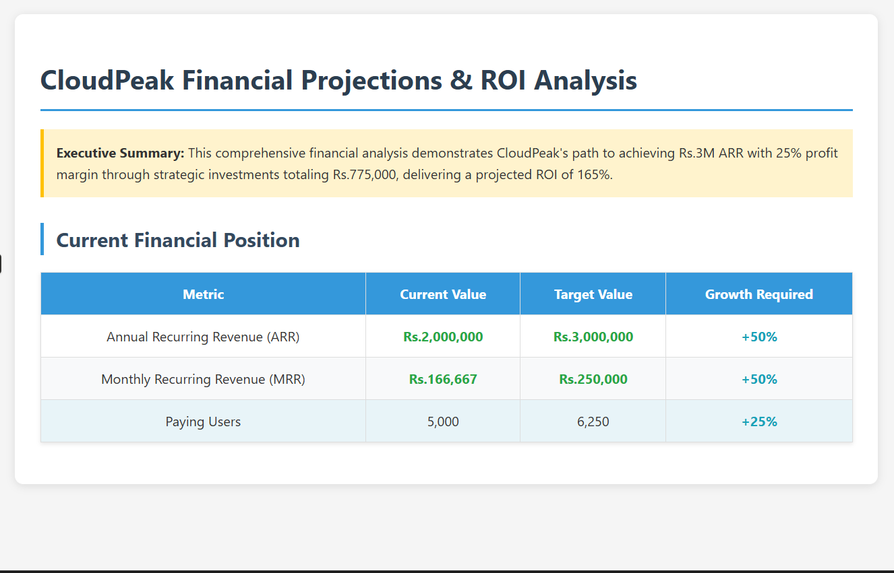

# CloudPeak SaaS Growth Strategy Analysis

## 📊 Business Analysis Project

A comprehensive business analysis and growth strategy for CloudPeak, a project management SaaS startup, focusing on customer acquisition optimization and revenue enhancement.

### 🎯 Project Overview

**Client**: CloudPeak SaaS Startup  
**Challenge**: Low trial-to-paid conversion rate (10%) and growth targets  
**Goal**: Scale ARR from Rs.2M to Rs.3M with 25% profit margin in 9 months

### 📈 Key Metrics Analyzed

- **Current ARR**: Rs.2,000,000
- **Paying Users**: 5,000
- **Customer Acquisition Cost**: Rs.500
- **Trial-to-Paid Conversion**: 10%
- **Target ARR**: Rs.3,000,000
- **Target Profit Margin**: 25%

### 🔍 Analysis Scope

1. **Problem Identification**
   - User feedback analysis
   - Conversion funnel optimization
   - Cost structure evaluation

2. **Strategic Initiatives**
   - Onboarding optimization
   - Feature awareness campaigns
   - Personalized trial experiences
   - Referral programs
   - Retention strategies

3. **Financial Projections**
   - Investment requirements
   - Revenue impact modeling
   - ROI calculations
   - Risk assessments

### 📊 Key Findings

- **Primary Barriers**: Complex onboarding (40%) and low feature awareness (30%)
- **Recommended Investment**: Rs.550,000 across 5 initiatives
- **Projected ROI**: 285% within 9 months
- **Expected Conversion Rate**: 10% → 18%

### 🎯 Strategic Recommendations

1. **Immediate Focus**: Onboarding optimization and feature awareness
2. **Medium-term**: Personalization and referral programs
3. **Long-term**: Retention and expansion strategies

